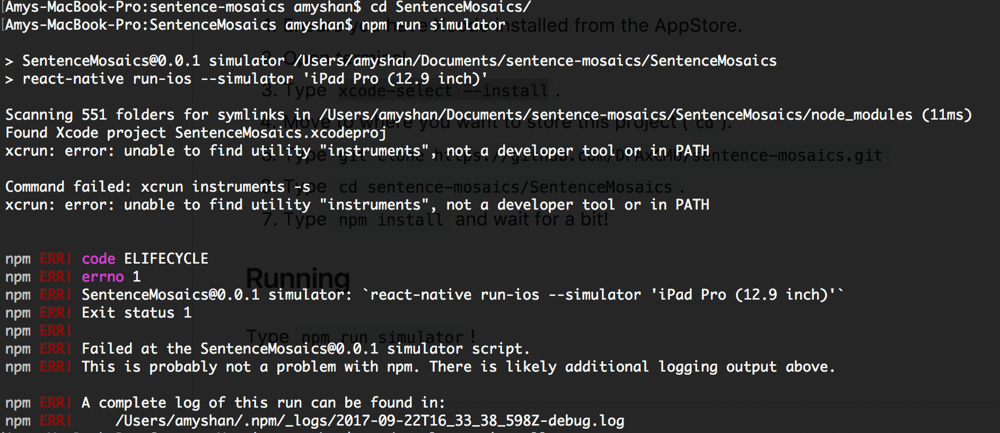

# sentence-mosaics

## Initial Setup

1. Ensure you have Xcode installed from the AppStore. 
2. Open terminal. 
3. Type `xcode-select --install`. 
4. Move to where you want to store this project (`cd`).  
5. Type `git clone https://github.com/DFAxCMU/sentence-mosaics.git`
3. Type `cd sentence-mosaics/SentenceMosaics`. 
4. Type `npm install` and wait for a bit! 

## Running 

Type `npm run simulator`!

## Troubleshooting 

Open Xcode. Go to Xcode->Preferences->Locations and select an installation for command line tools. 

Use `npm run simulator-updated` instead. 
